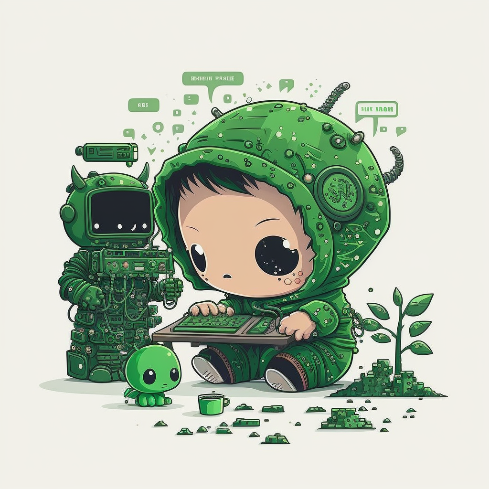

## Hi, i'm **Nguyen Manh Tung** ✨

### About me 🙋‍♂️

I'm a **Software Engineer**. I love to learn new things and I'm always curious about new things. In future, I want to improve my skills and become a **Fullstack Developer**. Focus on **javascript** and typescript (future), also I know a little bit about C# and Java.

I'm try to be a good leader and a good teammate. I always try to help my teammates and learn from them. I'm a hard-working person and try to do my best. 

### How to reach me 📫

I have some social media accounts, you can contact me through them:

-  [facebook](https://www.facebook.com/dev.adonis.gm/)
-  [study@nmtung.dev](mailto:study@nmtung.dev) or [nmtung.study@gmail.com](mailto:nmtung.study@gmail.com)
-  [nmtung](https://t.me/nmtung)
-  [nmtungofficial](skype:live:nmtungofficial)

and my CV here: [Nguyen-Manh-Tung_CV.pdf](./pdfs/Nguyen-Manh-Tung_CV.pdf)

### My projects 👨‍💻

- **[Academic Management System](https://github.com/FPT-NMTung/academic-management-system)**: A web application for managing academic activities of a university. This project is built with **ReactJS** and **.Net Core**. I'm the **Team Leader** and **FullStack Developer**.
- **[Quizlet Learn](https://github.com/AdonisGM/quizlet-learn)**: Like Quizlet, but it's a web application for learning and free. This project is built with **ReactJS** and **NodeJS**.

### My skills 🧑‍💻

- **Languages:**  Javascript,  Typescript,  C#
- **Frameworks:**  React,  Nodejs
- **Databases:** Oracle,  MongoDB,  SQL Server
- **Others:**  Git,  Github,  VSCode
